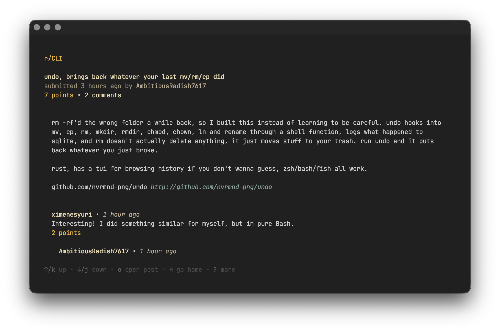
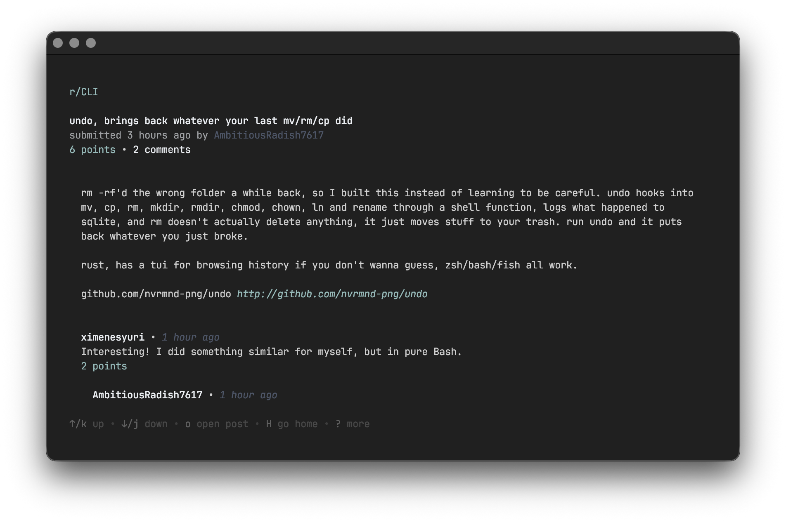

# reddit-tui-colorscheme
A collection of colorschemes for reddit-tui

## default

    
Color configuration

    <pre><code>[colors]
accent = "#FF713E"
link = "#6688E4"
negative = "#6B5DFB"
text = "#F5F5F5"
subtext = "#D0D0D0"</code></pre>

## afterglow

    
Color configuration

    <pre><code>[colors]
accent = "#CC6B53"
link = "#6C99BA"
negative = "#9E4E85"
text = "#D0D0D0"
subtext = "#505050"</code></pre>

## catppuccin

    
Color configuration

    <pre><code>[colors]
accent = "#EF9F76"
link = "#8AADF4"
negative = "#B7BDF8"
text = "#C6D0F5"
subtext = "#A5ADCE"</code></pre>

## claude

    
Color configuration

    <pre><code>[colors]
accent = "#D4967E"
link = "#D4967E"
negative = "#D4967E"
text = "#EBE7DF"
subtext = "#6B665F"</code></pre>

## dracula

    
Color configuration

    <pre><code>[colors]
accent = "#FFB86C"
link = "#6272A4"
negative = "#BD93F9"
text = "#F8F8F2"
subtext = "#505050"</code></pre>

## gruvbox

    
Color configuration

    <pre><code>[colors]
accent = "#FABD2F"
link = "#83A598"
negative = "#D3869B"
text = "#EBDBB2"
subtext = "#BDAE93"</code></pre>

## material

    
Color configuration

    <pre><code>[colors]
accent = "#F5971D"
link = "#26BAD1"
negative = "#A94DBB"
text = "#EEEEEE"
subtext = "#D8D8D8"</code></pre>

## monochrome

    
Color configuration

    <pre><code>[colors]
accent = "#FFFFFF"
link = "#FFFFFF"
negative = "#FFFFFF"
text = "#FFFFFF"
subtext = "#FFFFFF"</code></pre>

## nord-frost

    
Color configuration

    <pre><code>[colors]
accent = "#8FBCBB"
link = "#8FBCBB"
negative = "#8FBCBB"
text = "#ECEFF4"
subtext = "#4C566A"</code></pre>

## nord

    
Color configuration

    <pre><code>[colors]
accent = "#D08770"
link = "#5E81AC"
negative = "#B48EAD"
text = "#ECEFF4"
subtext = "#4C566A"</code></pre>

## solarized

    
Color configuration

    <pre><code>[colors]
accent = "#CB4B16"
link = "#268BD2"
negative = "#6C71C4"
text = "#FDF6E3"
subtext = "#EEE8D5"</code></pre>

